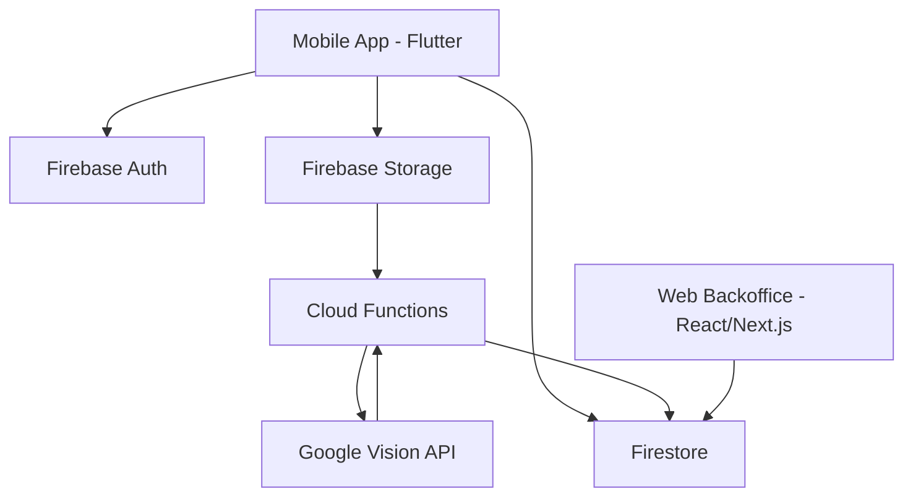

# Arquitetura Tecnica do MVP

## Resumo da arquitetura

O MVP sera composto por uma app mobile para recolha de dados, um backend serverless em Firebase para persistencia e processamento, e um backoffice web para consulta e gestao operacional.

## Diagrama de alto nivel



## Modulos da aplicacao mobile

### Fluxo principal

1. Login Screen
2. Camera Screen ou Gallery Upload
3. Photo Preview and Upload
4. Results Screen
5. History List

### Responsabilidades

- Autenticacao do utilizador.
- Captura ou selecao de imagem.
- Recolha de descricao e localizacao.
- Upload da imagem e criacao do relato.
- Consulta do resultado de analise.
- Consulta do historico de ocorrencias enviadas.

## Componentes do backend

### Firebase Auth

- Login/signup de utilizadores.
- Associacao do relato a um utilizador autenticado.

### Firebase Storage

- Armazenamento das imagens enviadas pelo mobile.
- Fonte do trigger de processamento.

### Firestore

- Base de dados central para relatos, utilizadores e resultados.
- Fonte de dados para mobile e backoffice.

### Cloud Functions

- Reacao ao upload ou criacao de relato.
- Chamada a Google Vision API.
- Persistencia dos resultados da analise no Firestore.
- Possivel enriquecimento de metadados no futuro.

### Google Vision API

- Analise automatica da imagem.
- Extracao de labels, objetos ou sinais uteis para classificacao inicial.

## Modulos do backoffice web

### Modulos previstos

- Dashboard
- Photo Gallery / lista de relatos
- Analytics / relatorios basicos
- User Management
- Search / Filter
- Export (CSV/PDF)

### Objetivo do backoffice

Dar aos administradores municipais uma interface adequada para consulta, triagem e acompanhamento de relatos, algo que nao e conveniente fazer numa app mobile.

## Fluxo de conexao

```text
Mobile App (Flutter)
  -> envia foto + descricao + localizacao + metadados

Firebase Storage / Firestore
  -> guardam imagem e registo inicial do relato

Cloud Functions
  -> processam o evento de upload ou criacao
  -> chamam a Google Vision API

Firestore
  -> recebe o resultado da analise
  -> serve como base central para mobile e web

Web Backoffice (React/Next.js)
  -> le e atualiza dados no Firestore
```

## Decisoes tecnicas iniciais

- Flutter para mobile devido a rapidez de entrega cross-platform.
- Firebase como backend principal para reduzir esforco de infraestrutura.
- Google Vision API como primeiro servico de IA para classificacao assistida.
- React/Next.js no backoffice por ser mais adequado a dashboards, tabelas e filtros.

## Pontos a validar

- Se o trigger deve ocorrer no upload do ficheiro ou na criacao do documento do relato.
- Quais campos da Google Vision API sao realmente uteis para o municipio.
- Se a exportacao CSV/PDF entra no MVP ou fica para fase seguinte.
- Se analitica e gestao de utilizadores entram logo no primeiro release interno.
